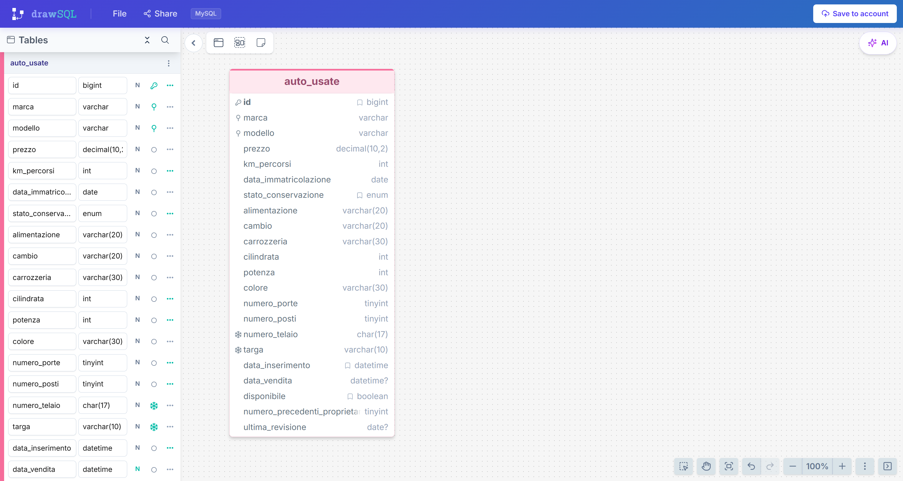

# Db First

Modellazione della struttura di una tabella per la gestione di auto usate in vendita.

# Obiettivo 

Realizzare tramite **drawSQL** una struttura di tabella **MySQL** per la gestione dei dati relativi alle auto usate in vendita presso un concessionario.

## drawSQL

[Visualizza il modello del database su drawSQL](https://drawsql.app/draw?t=48dc720f-cc71-4976-ae17-9a0c88323325&view=1)

## Screenshot drawSQL

